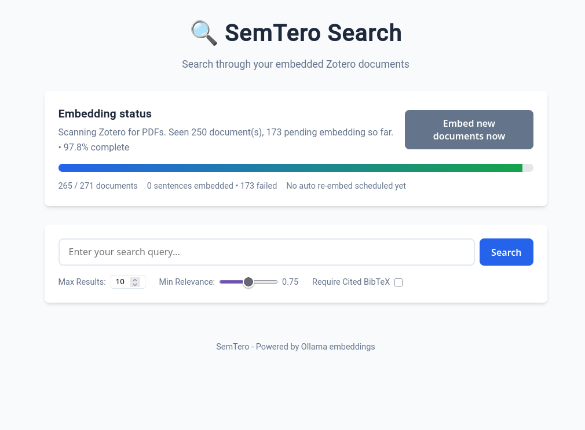

# SemTero


SemTero is a local RAG stack for your Zotero library.
It embeds PDF-backed Zotero items with Ollama, enables semantic search over the embedded sentences, and exposes a small web UI and MCP server for you.



## What you get

- MCP server for Zotero-backed Semantic search
- Web UI for manual searching and embedding status
- Background embedding with CLI and web progress bars
- Automatic re-scan for newly added documents after a configurable cooldown
- Web UI button to embed newly discovered documents immediately
- Document-level BibTeX on all search hits
- Optional cited-reference BibTeX when extracted from PDFs

## Prerequisites

- Python 3.12+
- [uv](https://docs.astral.sh/uv/) recommended
- Zotero running locally on the host
- Ollama running locally or on another reachable machine
- The embedding and reranker models pulled in Ollama

## Important requirement

**Zotero must be running on the host for this project to work correctly.**

This project talks to Zotero's local API/connector (default: `http://127.0.0.1:23119`).
If Zotero is not running, document discovery, PDF access, metadata lookup, and BibTeX import will fail.
Enable "Allow other appplications on this computer to communicate with Zotero" in Zotero's "Advanced" settings to allow the app to connect.


Example:

```bash
ollama pull qwen3-embedding:4b
ollama pull dengcao/Qwen3-Reranker-0.6B:Q8_0
```

## Configuration

The app copies `.env.example` to `.env` automatically on first run if `.env` is missing.

Key settings:

- `ZOTERO_API_URL` — local Zotero endpoint
- `OLLAMA_BASE_URL` — Ollama endpoint
- `LOG_LEVEL` — root log level, defaults to `WARNING`
- `NOISY_LOG_LEVEL` — noisy dependency log level, defaults to `WARNING`
- `AUTO_REEMBED_INTERVAL_MINUTES` — how long to wait after a background embedding pass finishes before the next auto re-scan
- `EMBED_PROGRESS_INTERVAL_SEC` — CLI progress refresh rate
- `APP_HOST` / `WEBUI_HOST` — bind hosts for server and UI
- `RERANKER_GPU_MIN_VRAM_GB` — minimum total and currently free VRAM required before the reranker will move to CUDA; defaults to `8.0`

Production defaults are intentionally quiet:

```dotenv
LOG_LEVEL=WARNING
NOISY_LOG_LEVEL=WARNING
RERANKER_GPU_MIN_VRAM_GB=8.0
```

The reranker now loads onto CUDA only when a compatible GPU has enough VRAM available, and it releases the model plus cached CUDA memory immediately after reranking finishes.

## Local setup

Install dependencies:

```bash
uv sync
```

Run the app with HTTP transport plus web UI:

```bash
uv run python main.py --transport streamable-http --host 127.0.0.1 --port 23120 --webui-port 23121
```

Useful checks:

```bash
uv run python main.py --test-zotero
uv run python main.py --test-ollama
```

## Web UI

Default web UI address:

```text
http://127.0.0.1:23121
```

The UI shows:

- current background embedding state
- progress bar for the active job
- next scheduled auto re-embed time
- button: **Embed new documents now**
- search results with document BibTeX and any cited-reference BibTeX

## CLI progress output

While background embedding runs, the CLI prints a live progress bar with:

- processed documents / total documents
- completion percentage
- embedded sentence count
- failed document count

## Docker

### Important Docker note

**Zotero still has to run on the host.**
The container must be able to reach Zotero on port `23119` and Ollama on port `11434`.

The included Compose file uses `host.docker.internal` with Docker's host-gateway mapping.
On Linux, this works on current Docker versions. If it does not work in your setup, use host networking instead.

### Build the image

```bash
docker build -t semtero .
```

### Run with Docker Compose

```bash
docker compose up --build
```

Default ports:

- MCP / HTTP transport: `23120`
- Web UI: `23121`

### Host-network alternative

If your environment cannot resolve `host.docker.internal`, switch the service to host networking in `docker-compose.yml`:

```yaml
network_mode: host
```

If you do that, remove the `ports:` block because host networking already exposes the service directly.

## Docker environment notes

The provided Docker setup binds the app on all interfaces inside the container:

- `APP_HOST=0.0.0.0`
- `WEBUI_HOST=0.0.0.0`

The Compose file also mounts:

- `./data` to persist vector data and cached PDFs
- `./.env` into the container so local config stays consistent

## Running in stdio mode

If you only want stdio transport locally:

```bash
uv run python main.py --transport stdio
```

## Search result behavior

Search results include:

- matched sentence text
- document title and metadata
- document-level BibTeX for the Zotero item
- cited-reference BibTeX when available from the embedded PDF sentence metadata

That means you get BibTeX for every document hit, not just the sentences that already carried embedded citations.

## Troubleshooting

### Zotero connection fails

- make sure Zotero is running
- make sure `ZOTERO_API_URL` points to the host where Zotero is running
- if using Docker, verify the container can reach `host.docker.internal:23119`

### Ollama connection fails

- make sure Ollama is running
- make sure the configured embedding model exists
- if using Docker, verify the container can reach `host.docker.internal:11434`

### Web UI starts but embedding never progresses

- verify Zotero has items with PDFs
- verify Zotero can serve those PDFs locally
- check that the vector store directory is writable

### Logs are too noisy

Set these in `.env`:

```dotenv
LOG_LEVEL=WARNING
NOISY_LOG_LEVEL=WARNING
```

## Project layout

- `main.py` — main runtime entrypoint
- `src/semtero/` — app core
- `webui/` — Flask UI and static assets
- `tests/` — automated tests
- `Dockerfile` / `docker-compose.yml` — containerized execution

## License

SemTero © 2026 by Hendric Voss is licensed under [CC BY-NC-SA 4.0](https://creativecommons.org/licenses/by-nc-sa/4.0/).
The software is provided as-is and comes with no warranty or guarantee of support.
